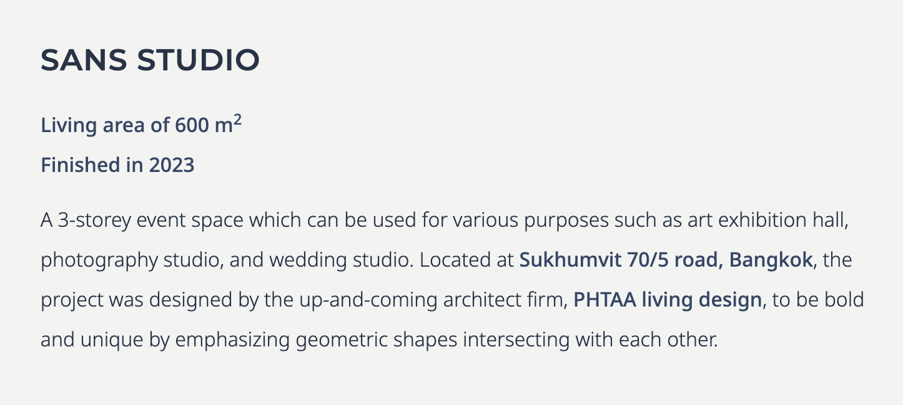

# CoCreate Construction Website

---

## Design Guide

### Font Family, Size, Weight, Letter-Spacing, Line-Height

**default body:** `font-notosans text-base/loose font-light`

- font family: Noto Sans
- size: 16px
- weight: light
- line-height: 2 (32px)

**body emphasize & link:** same as default body, but `font-medium`

- weight: medium

**heading:** `font-montserrat text-2xl/loose font-semibold tracking-wide`

- font family: Montserrat
- size: 24px
- weight: semibold
- letter-spacing: 0.025em
- line-height: 2 (48px)

**body (Thai):** Noto Sans Thai (ยังไม่รู้ว่าจะใช้มั้ย)

 

### Color

[Tailwind Stone](https://tailwindcss.com/docs/customizing-colors)

[ccblue & ccoldrose](https://uicolors.app/edit?sv1=cc-blue:50-f5f7fa/100-eaf0f6/200-cedee9/300-a4c1d6/400-739dbf/500-5183a9/600-3d678a/700-335471/800-2c485e/900-273c4f/950-1b2b37;stone:50-fafaf9/100-f5f5f4/200-e7e5e4/300-d6d3d1/400-a8a29e/500-78716c/600-57534e/700-44403c/800-292524/900-1c1917/950-0c0a09;cc-oldrose:50-faf7f6/100-f6edea/200-efddd9/300-e3c5be/400-d0a399/500-bb7f72/600-a7695b/700-8b564a/800-734a3f/900-573b33/950-341f1b)

    colors: {
        ccblue: {
            50: '#f5f7fa',
            100: '#eaf0f6',
            200: '#cedee9',
            300: '#a4c1d6',
            400: '#739dbf',
            500: '#5183a9',
            600: '#3d678a',
            700: '#335471',
            800: '#2c485e',
            900: '#273c4f',
            950: '#1b2b37',
        },
        ccoldrose: {
            50: '#faf7f6',
            100: '#f6edea',
            200: '#efddd9',
            300: '#e3c5be',
            400: '#d0a399',
            500: '#bb7f72',
            600: '#a7695b',
            700: '#8b564a',
            800: '#734a3f',
            900: '#573b33',
            950: '#341f1b',
        },
    },

 

### Breakpoints

Mobile: default
Tablet: `sm:` (640px and up)
Desktop: `lg:` (1024px and up)

 

### Margin, Padding, Width, Height

Undecided

 

### Box Shadow

Reference: [Tailwind Box Shadow](https://tailwindcss.com/docs/box-shadow)

- `shadow-md`
- `shadow-xl`
- `shadow-inner`
- for top edge of buttons: `box-shadow: inset 0 1px 0 0 hsla(0, 0%, 100%, 0.15);`

 

### Border Radius

none

 

### Border Width

Undecided

 

---

## Pages

### 1. Home

**Hero Banner**

- Logo + ชื่อบริษัท สีขาว เป็น foreground
- รูป BG สวย ๆ ซักรูป ปรับ contrast ลง และ monotone ให้เป็น shade สีน้ำเงิน

**Services**

one-stop service

- design
- construction
- interior

**Projects**

- banner มีรูปสวย ๆ 1 รูป และเขียนอะไรสั้น ๆ นิดหน่อย
- projects
  - รูป
  - ชื่อโครงการ
- กดแล้วเป็นไงต่อ ยังไม่ได้คิด อาจจะไปหน้า Project Page หรือเป็น popup ขึ้น detail มาก็ได้

**Our Strengths**

- Precision (ใช้ Revit ในการถอดปริมาณและเคลียร์แบบ)
- Civil Engineer (มีวิศวะคุมทุกไซต์ ไม่ใช่แค่ Foreman)
- Owner's Perspective (ช่วยแนะนำหากมีส่วนไหนที่ราคาแพงเกินไปหรือส่วนไหนที่สามารถประหยัดได้)
- Fairness (ไม่เอาเปรียบลูกค้า ไม่เอาเปรียบคนงาน)

**Team**

- รูปรวม หรือรูป 3 คน (ดุ๊ก บอส ภูมิ)
- กดแล้วไปหน้า Team Page

**Contact (เป็น footer มีทุก page)**

- จ้างก่อสร้าง / ออกแบบ
  - ธนโชติ (บอส)
  - เบอร์
  - line id
  - QR line
- จัดซื้อ / HR / บัญชี / อื่น ๆ
  - ดุ๊ก
  - เบอร์
  - line id
  - QR line
- Facebook Page
- Instagram

 

### 2. Projects

อาจจะไม่ต้องมีหน้าแยก แต่มีเมนูใน navbar เลือกแล้วเป็น anchor ไปที่ section นั้นในหน้า Home ถ้าใส่ไว้หน้า Home ได้หมด แล้วแต่จะออกแบบ

- พื้นที่ใช้สอย
- ปีที่สร้างเสร็จ
- รายละเอียด
  - ประเภทโครงการ (บ้าน / townhome / clubhouse / factory / อื่นๆ)
  - จำนวนชั้น
  - ผู้ออกแบบ
  - location
- button ไป contact us

ตัวอย่าง:

 

### 3. Team

เขียนถึง Vision / Mission เราเล็กน้อย

เป็นการ์ด ดุ๊ก + บอส + ภูมิ + ทีมวิศวกร 6 คน + แอ๊ม + หัวหน้าคนงาน 3-4 คน

- รูป
- ชื่อ
- ตำแหน่ง
- (optional) เขียนอะไรเล็กน้อย

 

### 4. Contact

ยังไม่รู้ว่าจะมีดีมั้ย อาจจะใส่เป็นแค่ footer ในทุก page แทน

 

---
